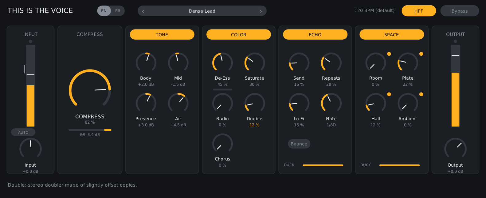
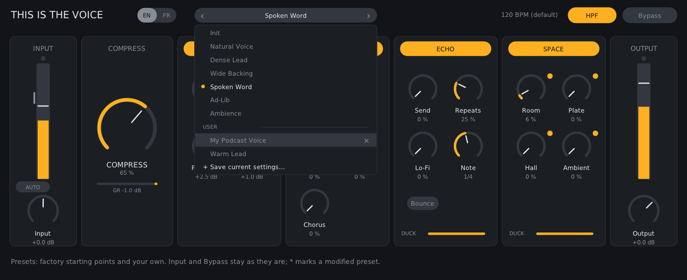

<h1 align="center">This Is The Voice</h1>

<p align="center"><b>Your voice, finished. With zero latency.</b><br>
A complete vocal chain in a single plugin, built for CLAP first.</p>

<p align="center">
  <a href="https://github.com/pehadavid/ThisIsTheVoice/releases"><b>Download</b></a> ·
  <a href="#build-from-source">Build from source</a> ·
  <a href="LICENSE">Free and open source</a>
</p>

<p align="center">
  <a href="https://github.com/pehadavid/ThisIsTheVoice/actions/workflows/build.yml"></a>
  
  
  
  
</p>

<p align="center"></p>

## Zero latency. Not "low". Zero.

Most vocal chains quietly add a few milliseconds here and there: a limiter that looks ahead, an oversampled saturator, a linear-phase filter. Stack them and your own voice comes back late in your headphones.

This Is The Voice adds none. Every module was designed to work on the sample it is given: the limiter reacts without looking ahead, Saturate is anti-aliased with antiderivatives instead of oversampling, every filter is minimum-phase. The plugin reports **0 samples** of latency to your host, and an impulse test checks it on every build.

So put it on the track you are recording, turn on input monitoring and sing through the full chain, compression, echo and reverbs included, exactly as it will sound in the mix.

## CLAP first.

[CLAP](https://cleveraudio.org) is the open, royalty-free plugin standard, and it is the format This Is The Voice is built and tested for first: every build runs the official clap-validator on Linux, macOS and Windows. If your host speaks CLAP (Bitwig Studio, Reaper, FL Studio, Studio One and more), load the CLAP version.

VST3 comes from the same code and passes Steinberg's validator, Audio Unit covers Logic Pro and GarageBand, and LV2 serves Linux hosts.

## Everything a vocal needs. Nothing it doesn't.

Input, tone, compression, colour, space and output, in the order you'd patch them, on one screen. Every control is where you expect it, the effect sections switch off in a click, and every knob tells you what it does the moment you hover it.

**One knob. All the compression.**
COMPRESS blends gentle parallel compression, a firmer serial stage and a peak limiter behind a single macro. Turn it up and the voice comes forward, while the output level stays put, so what you hear is the effect, not just "louder".

**Tone that listens.**
Body, Mid and Presence shape the voice. Air opens up the top and quietly backs off on every "s", so brightness never turns harsh.

**Colour, on tap.**
De-Ess, Saturate, Radio, Double and Chorus. Each one is silent at zero and musical from the first few percent: Double sounds like a second take, Chorus spreads wide, Saturate adds harmonics without the fizz.

**Space that knows when to step aside.**
A tempo-synced echo and four reverbs: Room, Plate, Hall and Ambient. While you sing, they duck out of the way. Between phrases, they bloom.

**The right level in ten seconds.**
Press Auto and sing. Auto Level listens to ten seconds of actual voice, ignoring silences and clicks, and sets the input for you. Changed your mind? One click brings the old gain back.

## Start from a sound. Make it yours.

Seven factory presets (Natural Voice, Dense Lead, Wide Backing, Spoken Word, Ad-Lib, Ambience and a neutral Init), each levelled so that switching between them compares sounds, not volumes. Save your own in a click; they follow you into every project.

<p align="center"></p>

## Wherever you make music.

CLAP and VST3 on Linux, macOS and Windows, Audio Unit on macOS, LV2 on Linux. Intel and Apple Silicon. Resizable to fit any screen, sharp on HiDPI displays.

## Download

Installers for Linux, macOS and Windows are on the [Releases page](https://github.com/pehadavid/ThisIsTheVoice/releases):

- **Linux x86_64:** extract the archive, then run `./install.sh` (current user) or `./install.sh --system` (all users).
- **macOS 10.15+ (Intel and Apple Silicon):** extract the `-macos.zip`, then in Terminal run `bash install.sh` from the extracted folder. It installs the CLAP, VST3 and AU versions for the current user (`--system` for every user, `--uninstall` to remove them). A `.pkg` installer is also provided.
- **Windows 10+ x64:** run the setup program; it installs the CLAP and VST3 versions and the standalone application.

In a host that supports CLAP, pick the CLAP version.

The macOS and Windows files are not signed by an identified developer. On macOS, the install script needs nothing more: it clears the quarantine flag macOS puts on downloaded files. The `.pkg` has to be allowed first in System Settings > Privacy & Security > Open Anyway. On Windows, SmartScreen shows More info, then Run anyway.

## Build from source

Everything below is for developers: building the plugin yourself, working on the code and releasing it.

### Linux

Dependencies (Debian/Ubuntu):

```sh
sudo apt install build-essential cmake ninja-build libx11-dev libxext-dev libgl-dev libjack-jackd2-dev
```

```sh
git clone --recursive https://github.com/pehadavid/ThisIsTheVoice.git
cd ThisIsTheVoice
cmake -S . -B build -G Ninja
cmake --build build
ctest --test-dir build --output-on-failure
```

The plugins are written to `build/bin/`: `ThisIsTheVoice.vst3`, `ThisIsTheVoice.clap`, `ThisIsTheVoice.lv2` and the standalone `ThisIsTheVoice` application (JACK, or native audio as a fallback).

To build and install into your user plugin folders (`~/.vst3`, `~/.clap`, `~/.lv2`, `~/.local/bin`):

```sh
scripts/install-linux.sh             # build, test, install
scripts/install-linux.sh --link      # symlink the build outputs instead: every rebuild is picked up
scripts/install-linux.sh --formats vst3,clap
scripts/install-linux.sh --uninstall
```

Bitwig Studio, Reaper and Ardour scan these folders by default; rescan plug-ins (or restart the host) after an update.

### macOS

With Xcode or the Command Line Tools, and CMake:

```sh
scripts/install-macos.sh             # universal binary, tests, AU + VST3 + CLAP into ~/Library/Audio/Plug-Ins, auval
scripts/install-macos.sh --formats au
scripts/install-macos.sh --uninstall
```

The AU format (the only one Logic Pro loads) is built on macOS only. Bundles get an ad-hoc signature, enough on your own machine; public distribution needs a Developer ID signature and notarization.

### Development

The engine and its tests build without DPF or any graphics dependency: `cmake -S . -B build -DTITV_BUILD_PLUGIN=OFF`. `build/tests/titv_bench [seconds]` runs the processing-time benchmark and `build/tests/titv_measure` prints the measured characteristics of every module.

```text
src/dsp/      DSP modules (tone, dynamics, colour effects, echo, reverbs, ducking, Auto Level), no dependencies
src/engine/   parameter registry, factory presets and signal chain
src/plugin/   DPF adapter (VST3, CLAP, LV2, AU, JACK)
src/ui/       NanoVG editor, user presets, English and French texts
tests/        tests, benchmark and measurement tool
patches/      small changes to DPF, applied at configure time
third_party/  Khronos OpenGL headers for Windows builds (MIT)
external/DPF  DISTRHO Plugin Framework (submodule)
```

Every push is built, tested and validated on Linux, macOS and Windows (clap-validator, pluginval, Steinberg's VST3 validator, auval) by `.github/workflows/build.yml`, which also packages the three installers. Work happens on the `dev` branch: every push to `dev` replaces the **Development build** pre-release with fresh installers, named after the next version (`<next version>-dev.<build number>`). Releases come from `main` and are numbered automatically: each merge of `dev` into `main` publishes the next patch after the latest `v*` tag, with the installers attached (versions below 1.0 as pre-releases). For a new minor or major version, raise `TITV_BASE_VERSION` in `CMakeLists.txt`: the next release starts from it (`scripts/ci/version.sh`). `scripts/package-linux.sh`, `scripts/package-macos.sh` and `packaging/windows/ThisIsTheVoice.iss` build the same installers by hand.

Parameter IDs (their order in `src/engine/Parameters.hpp`) and factory preset ids are frozen: saved projects depend on them, so new entries are only ever appended; tests enforce it.

`patches/` holds small changes to DPF, applied automatically when CMake configures the project, so the submodule stays upstream DPF:

- `dpf-tail.patch` reports the plugin's tail length (reverb and echo decay) to VST3 hosts;
- `dpf-vst3-parameter-sync.patch` applies controller-side VST3 parameter changes at once;
- `dpf-state-chunked-read.patch` fixes the CLAP and VST3 state parsers when a host delivers the saved state in small chunks.

## License

This Is The Voice is free software, released under the GNU General Public License, version 3 or later: see [LICENSE](LICENSE).

It is built with the following third-party components, whose licences are compatible with the GPLv3. Their copyright notices must accompany any distribution.

| Component | Used for | Licence | Copyright |
| --- | --- | --- | --- |
| [DPF](https://github.com/DISTRHO/DPF) (DISTRHO Plugin Framework) | plugin format adapters, editor window and drawing | ISC | 2012-2025 Filipe Coelho |
| DPF "travesty" | VST3 API definitions (the Steinberg SDK is not used) | ISC | 2012-2025 Filipe Coelho |
| [CLAP](https://github.com/free-audio/clap) | CLAP API headers, shipped with DPF | MIT | 2014-2022 Alexandre Bique |
| LV2 | LV2 API headers, shipped with DPF | ISC | 2006-2020 Steve Harris, David Robillard; 2000-2002 Richard W.E. Furse, Paul Barton-Davis, Stefan Westerfeld |
| [pugl](https://github.com/lv2/pugl) | windowing, shipped with DPF | ISC | David Robillard and contributors |
| [NanoVG](https://github.com/memononen/nanovg) | editor vector drawing, shipped with DPF | zlib | 2013 Mikko Mononen |
| DejaVu Sans | editor font, shipped with DPF | Bitstream Vera / DejaVu licence | Bitstream, Inc.; DejaVu contributors |
| [RtAudio](https://github.com/thestk/rtaudio), [RtMidi](https://github.com/thestk/rtmidi) | native audio of the standalone application only | MIT | 2001-2021 Gary P. Scavone |
| Khronos OpenGL headers (`glext.h`, `khrplatform.h`) | OpenGL declarations for Windows builds, in `third_party/khronos` | MIT | 2008-2026 The Khronos Group Inc. |

Full licence texts are in `external/DPF/LICENSE` and in each component's sources. VST is a trademark of Steinberg Media Technologies GmbH.
