<h1 align="center">This Is The Voice</h1>

<p align="center"><b>Your voice, finished. With zero latency.</b><br>
A complete vocal chain in a single plugin, built for CLAP first.</p>

<p align="center">
  <a href="https://github.com/pehadavid/ThisIsTheVoice/releases/latest"><b>Download</b></a> ·
  <a href="#build-from-source">Build from source</a> ·
  <a href="LICENSE">Free and open source</a>
</p>

<p align="center">
  <a href="https://github.com/pehadavid/ThisIsTheVoice/actions/workflows/build.yml"></a>
  
  
  
  
</p>

<p align="center">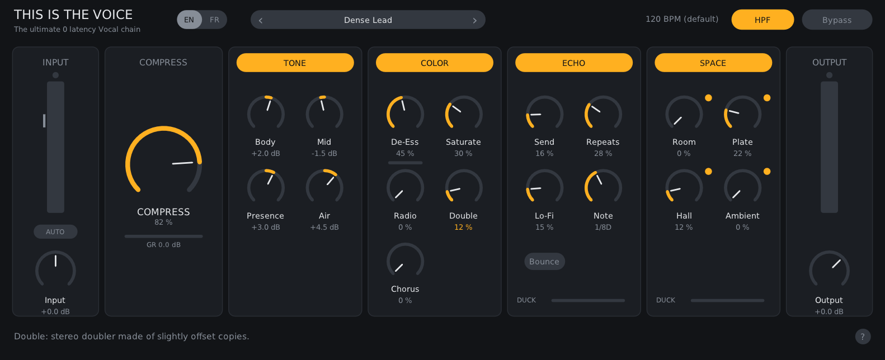</p>

## Zero latency. Not "low". Zero.

Most vocal chains quietly add a few milliseconds here and there: a limiter that looks ahead, an oversampled saturator, a linear-phase filter. Stack them and your own voice comes back late in your headphones.

This Is The Voice adds none. Every module was designed to work on the sample it is given: the limiter reacts without looking ahead, Saturate is anti-aliased with antiderivatives instead of oversampling, every filter is minimum-phase. The plugin reports **0 samples** of latency to your host, and an impulse test checks it on every build.

So put it on the track you are recording, turn on input monitoring and sing through the full chain, compression, echo and reverbs included, exactly as it will sound in the mix.

## CLAP first

[CLAP](https://cleveraudio.org) is the open, royalty-free plugin standard, and it is the format This Is The Voice is built and tested for first: every build runs the official clap-validator on Linux, macOS and Windows. If your host speaks CLAP (Bitwig Studio, Reaper, FL Studio, Studio One and more), load the CLAP version.

VST3 comes from the same code and passes Steinberg's validator, Audio Unit covers Logic Pro and GarageBand, and LV2 serves Linux hosts.

## Everything a vocal needs

Input, tone, compression, colour, space and output, in the order you'd patch them, on one screen. Every control is where you expect it, the effect sections switch off in a click, and every knob tells you what it does the moment you hover it.

**Tuned to your voice.**
A single switch, Male, Neutral or Female, moves the processing to the pitch and sibilance range of the singer: the low cut protects a deep fundamental or trims more rumble under a high voice, the tone bands follow, and De-Ess targets the right "s". Presets never touch it, so it stays set for the singer.

**One knob. All the compression.**
COMPRESS blends gentle parallel compression, a firmer serial stage and a peak limiter behind a single macro. Turn it up and the voice comes forward, while the output level stays put, so what you hear is the effect, not just "louder".

**Tone that listens.**
Body, Mid and Presence shape the voice. Air opens up the top and quietly backs off on every "s", so brightness never turns harsh.

**Colour, on tap.**
De-Ess, Saturate, Radio, Double and Chorus. Each one is silent at zero and musical from the first few percent: Double sounds like a second take, Chorus spreads wide, Saturate adds harmonics without the fizz.

**Space that knows when to step aside.**
A tempo-synced echo and four reverbs: Room, Plate, Hall and Ambient. While you sing, they duck out of the way. Between phrases, they bloom.

**The right level in ten seconds.**
Press Auto and sing. Auto Level listens to ten seconds of actual voice, ignoring silences and clicks, and sets the input for you. Changed your mind? One click brings the old gain back.

## Start from a sound. Make it yours

Seven factory presets (Natural Voice, Dense Lead, Wide Backing, Spoken Word, Ad-Lib, Ambience and a neutral Init), each levelled so that switching between them compares sounds, not volumes. Save your own in a click; they follow you into every project.

<p align="center">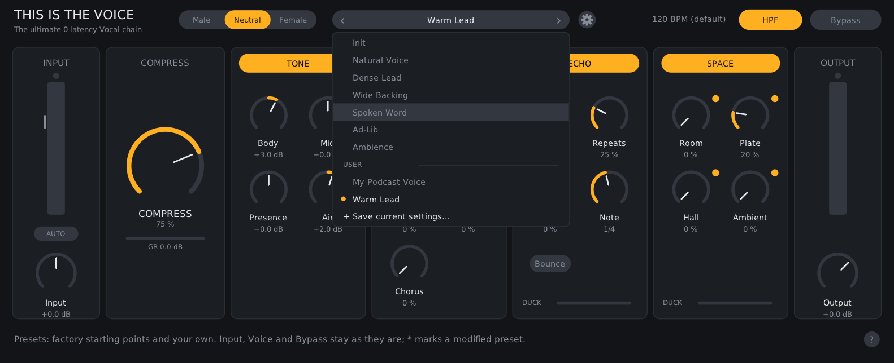</p>

## Wherever you make music

CLAP and VST3 on Linux, macOS and Windows, Audio Unit on macOS, LV2 on Linux. Intel and Apple Silicon. Resizable to fit any screen, sharp on HiDPI displays.

## Measurements

Every graph below was rendered from the plugin's actual audio engine, one control at a time, with everything else set to neutral (HPF off, COMPRESS at 0 %, TONE off, every other knob at 0). Each control is shown at 0 %, 50 % and 100 %.

- **Test signal:** a synthetic voice at -18 dBFS RMS, with moving pitch and vowels, phrases alternating between loud and 18 dB quieter, a sharp "s" every 0.75 s and a 45 Hz rumble underneath. EQ-type controls are also measured on pink noise.
- **How to read a spectrogram (top row):** time runs left to right, frequency bottom to top, and brighter means louder. The horizontal stripes are the harmonics of the voice, the vertical flashes at the top are the "s" sounds, and the band at the very bottom is the rumble.
- **The graph underneath** zooms in on what that control changes: a frequency response, a level over time, or a spectrum.

Measured on 2026-09-27 with version 0.9.x. A synthetic voice makes every graph repeatable; a real voice will not give the same numbers, but it will follow the same trends.

### HPF

Two gentle high-pass filters, one at the input (90 Hz) and one at the output (100 Hz). Together they take off 5 dB at 100 Hz and 18 dB at 60 Hz, and leave everything above 200 Hz alone. On the spectrogram, the rumble band at the bottom goes dark while the voice stays exactly as it was.

<p align="center">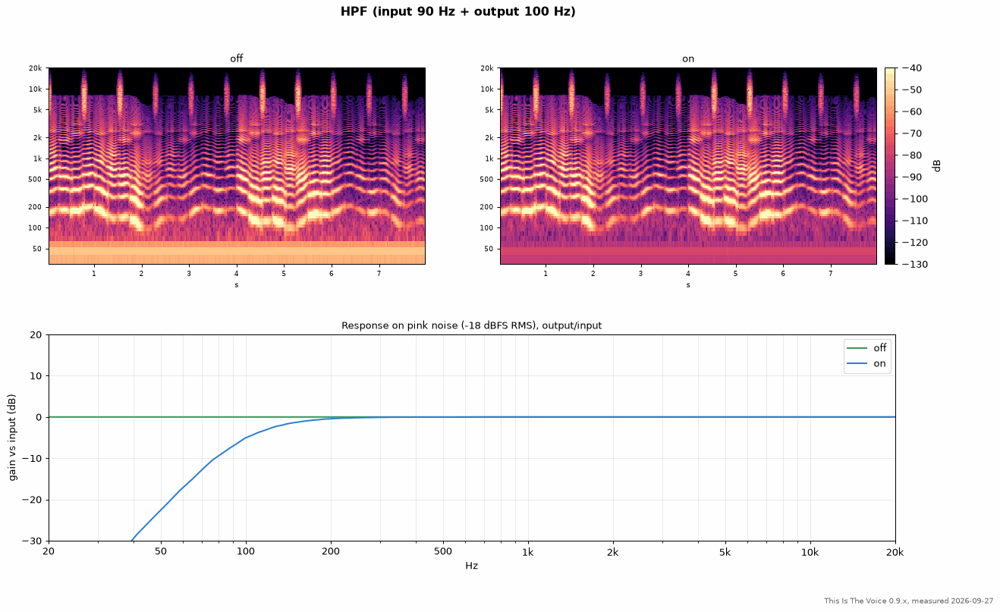</p>

### COMPRESS

The bottom graph follows the level of the voice over time. At 0 %, loud and quiet phrases are about 25 dB apart. At 50 % the gap shrinks to 16 dB, at 100 % to 8 dB: quiet phrases come up, loud ones come down, peaks never pass -2 dBFS, and the average level stays within 2 dB of the input. The spectrograms barely change, because COMPRESS works on level, not on tone. At 100 %, anything quiet comes up with the voice, low rumble included: that is what the HPF is for.

<p align="center">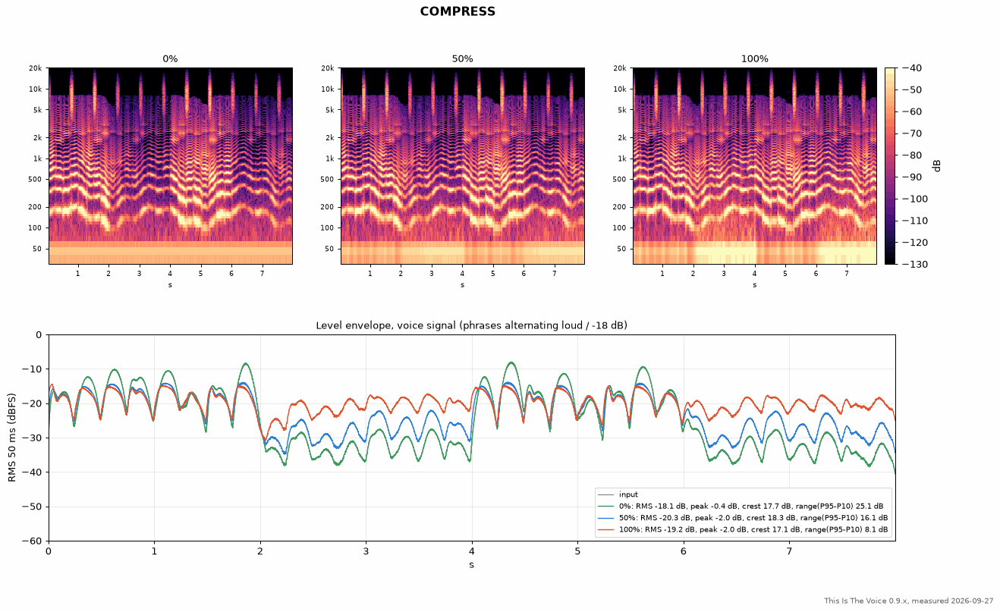</p>

### TONE

Each band runs from -15 dB (0 %) to +15 dB (100 %), with 0 dB in the middle. The middle curve is not perfectly flat, on purpose: whenever TONE is on, it adds a gentle built-in colour, about 1.5 dB less around 250 Hz and 1.5 dB more at the very top.

**Body** is a low shelf for the weight of the voice: it acts below about 300 Hz and reaches its full ±15 dB below 60 Hz.

<p align="center">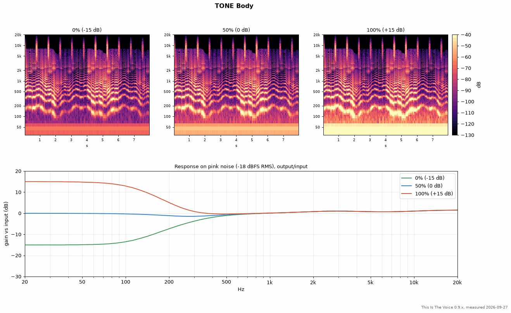</p>

**Mid** is a bell centred around 1.2 kHz, where a voice sounds nasal or boxy when there is too much and hollow when there is too little.

<p align="center">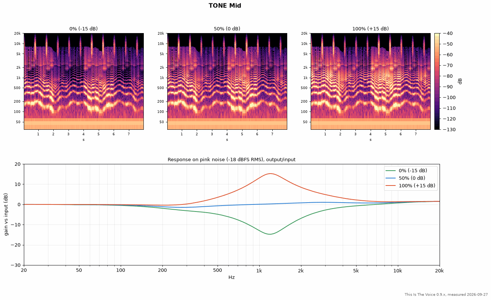</p>

**Presence** is a bell centred around 4.5 kHz, the range that makes words clear and brings the voice to the front.

<p align="center">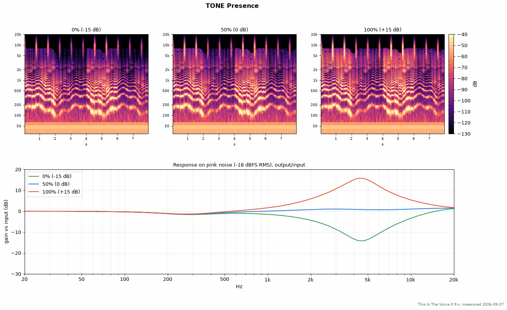</p>

**Air** is a high shelf above 5 kHz, and a dynamic one: it backs off on every "s", so the boost is reserved for breath and shine. That is why its curve is slightly uneven, and why on noise it reaches about +11 dB at 20 kHz rather than the full +15.

<p align="center">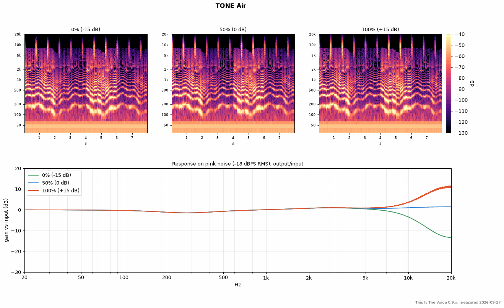</p>

### COLOR

**De-Ess** only acts while an "s" is sounding (solid lines): up to about 6 dB at 50 % and 12 dB at 100 %, centred on 7 kHz. The rest of the voice (dashed lines) stays within a fraction of a dB. Detection compares the "s" to the rest of the voice rather than to a fixed level, so the same setting works whether you sing softly or loudly.

<p align="center">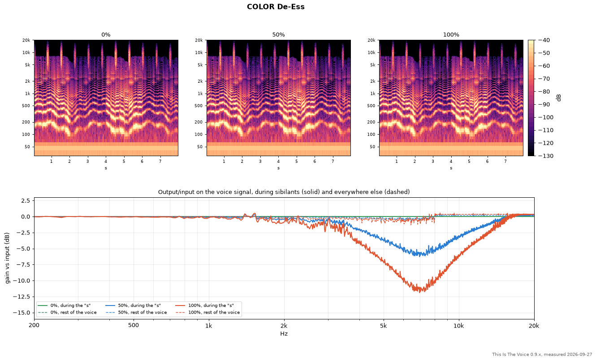</p>

**Saturate** adds harmonics in parallel. The bottom graph feeds it a single 220 Hz tone: at 0 % there is nothing but that tone, at 50 % a few harmonics appear, and at 100 % they stack up to about 5 kHz, mostly odd ones, for warmth and density without fizz.

<p align="center">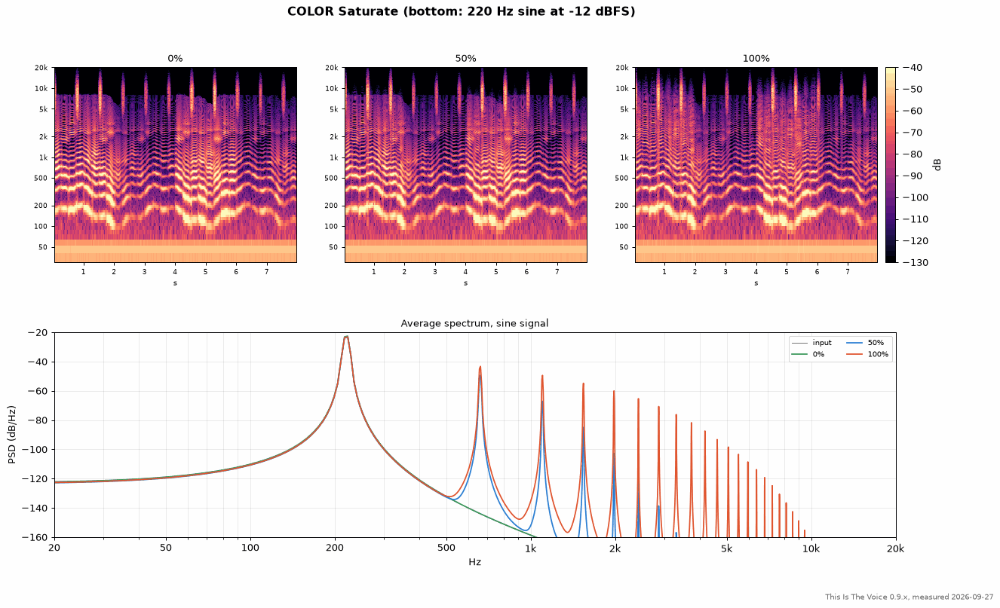</p>

**Radio** narrows the voice down to a telephone band, about 350 Hz to 3.4 kHz, with a small bump around 1.7 kHz. At 100 % it is a pure telephone voice. Halfway, the original and the filtered voice are blended, and at the two edges of the band they partly cancel each other: the two dips on the 50 % curve are that cancellation, and they give the in-between settings their slightly phased, vintage character.

<p align="center">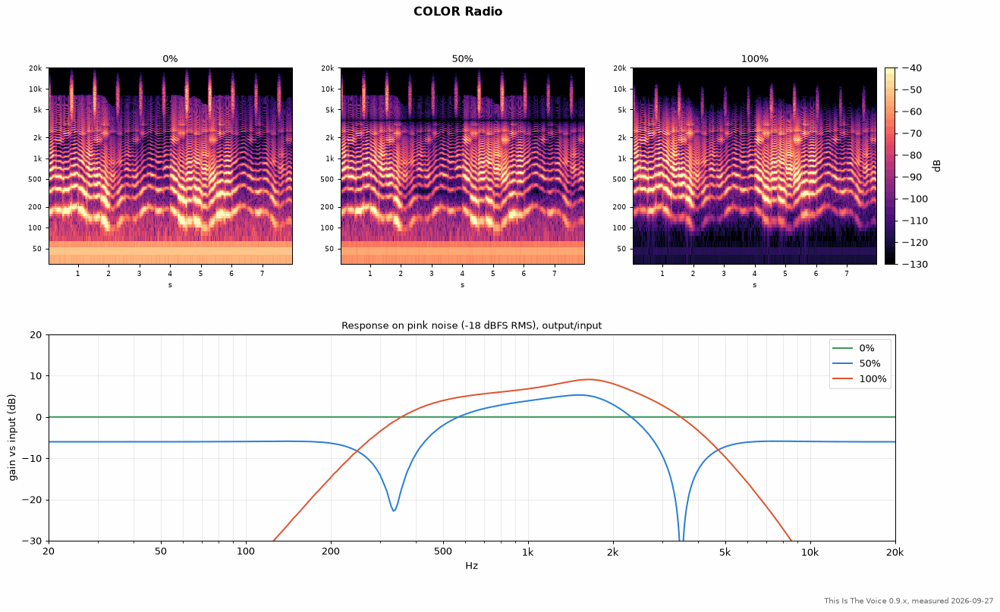</p>

**Double** adds slightly delayed, slightly detuned copies, spread left and right, like a second take. The bottom graph splits the output into mid (what both speakers share, solid) and side (the difference between them, dashed): at 0 % there is no side at all, since the test voice is mono; turn the knob up and the side appears while the mid barely moves, so the voice gets wider without getting muddier.

<p align="center">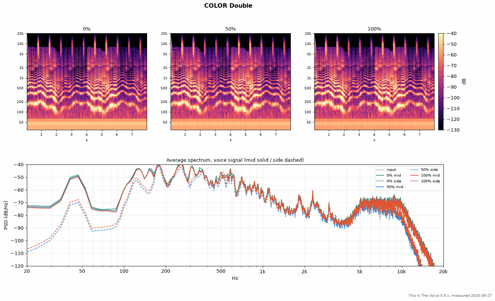</p>

**Chorus** does the same with continuously modulated delays, for a wider and more obviously moving sound. On the spectrogram, the lowest frequencies pulse gently with the modulation; with the HPF on, there is nothing down there to pulse.

<p align="center">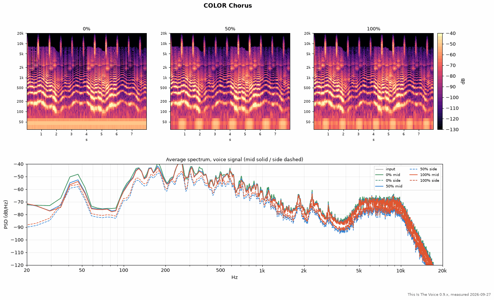</p>

## Download

Installers for Linux, macOS and Windows are attached to the [latest release](https://github.com/pehadavid/ThisIsTheVoice/releases/latest). Development builds from the `dev` branch are on the [Releases page](https://github.com/pehadavid/ThisIsTheVoice/releases) as a pre-release.

- **Linux x86_64:** extract the archive, then run `./install.sh` (current user) or `./install.sh --system` (all users).
- **macOS 10.15+ (Intel and Apple Silicon):** extract the `-macos.zip`, then in Terminal run `bash install.sh` from the extracted folder. It installs the CLAP, VST3 and AU versions for the current user (`--system` for every user, `--uninstall` to remove them). A `.pkg` installer is also provided.
- **Windows 10+ x64:** run the setup program; it installs the CLAP and VST3 versions and the standalone application.

In a host that supports CLAP, pick the CLAP version.

### Update notice

When the editor opens, the plugin checks GitHub for a newer build and, if there is one, shows a small "Update available" notice at the bottom right; clicking it opens the download page, and the cross next to it ignores that version. A build from `main` is only offered newer releases; a build from `dev` is only offered a newer development build. The answer is kept for six hours, so opening many editors sends one request. Builds compiled from source never check. The check can be turned off with the gear button (Settings). On Linux and macOS it uses `curl`, or `wget` if `curl` is missing; with neither, nothing happens.

The macOS and Windows files are not signed by an identified developer. On macOS, the install script needs nothing more: it clears the quarantine flag macOS puts on downloaded files. The `.pkg` has to be allowed first in System Settings > Privacy & Security > Open Anyway. On Windows, SmartScreen shows More info, then Run anyway.

## Build from source

To build the plugin yourself. The engine and its tests also build alone, without DPF or any graphics dependency: `cmake -S . -B build -DTITV_BUILD_PLUGIN=OFF`.

### Linux

Dependencies (Debian/Ubuntu):

```sh
sudo apt install build-essential cmake ninja-build libx11-dev libxext-dev libgl-dev libjack-jackd2-dev
```

```sh
git clone --recursive https://github.com/pehadavid/ThisIsTheVoice.git
cd ThisIsTheVoice
cmake -S . -B build -G Ninja
cmake --build build
ctest --test-dir build --output-on-failure
```

The plugins are written to `build/bin/`: `ThisIsTheVoice.vst3`, `ThisIsTheVoice.clap`, `ThisIsTheVoice.lv2` and the standalone `ThisIsTheVoice` application (JACK, or native audio as a fallback).

To build and install into your user plugin folders (`~/.vst3`, `~/.clap`, `~/.lv2`, `~/.local/bin`):

```sh
scripts/install-linux.sh             # build, test, install
scripts/install-linux.sh --link      # symlink the build outputs instead: every rebuild is picked up
scripts/install-linux.sh --formats vst3,clap
scripts/install-linux.sh --uninstall
```

Bitwig Studio, Reaper and Ardour scan these folders by default; rescan plug-ins (or restart the host) after an update.

### macOS

With Xcode or the Command Line Tools, and CMake:

```sh
scripts/install-macos.sh             # universal binary, tests, AU + VST3 + CLAP into ~/Library/Audio/Plug-Ins, auval
scripts/install-macos.sh --formats au
scripts/install-macos.sh --uninstall
```

The AU format (the only one Logic Pro loads) is built on macOS only. Bundles get an ad-hoc signature, enough on your own machine; public distribution needs a Developer ID signature and notarization.

## License

This Is The Voice is free software, released under the MIT License: see [LICENSE](LICENSE).

It is built with the following third-party components, whose licences are all permissive. Their copyright notices must accompany any distribution.

| Component | Used for | Licence | Copyright |
| --- | --- | --- | --- |
| [DPF](https://github.com/DISTRHO/DPF) (DISTRHO Plugin Framework) | plugin format adapters, editor window and drawing | ISC | 2012-2025 Filipe Coelho |
| DPF "travesty" | VST3 API definitions (the Steinberg SDK is not used) | ISC | 2012-2025 Filipe Coelho |
| [CLAP](https://github.com/free-audio/clap) | CLAP API headers, shipped with DPF | MIT | 2014-2022 Alexandre Bique |
| LV2 | LV2 API headers, shipped with DPF | ISC | 2006-2020 Steve Harris, David Robillard; 2000-2002 Richard W.E. Furse, Paul Barton-Davis, Stefan Westerfeld |
| [pugl](https://github.com/lv2/pugl) | windowing, shipped with DPF | ISC | David Robillard and contributors |
| [NanoVG](https://github.com/memononen/nanovg) | editor vector drawing, shipped with DPF | zlib | 2013 Mikko Mononen |
| DejaVu Sans | editor font, shipped with DPF | Bitstream Vera / DejaVu licence | Bitstream, Inc.; DejaVu contributors |
| [RtAudio](https://github.com/thestk/rtaudio), [RtMidi](https://github.com/thestk/rtmidi) | native audio of the standalone application only | MIT | 2001-2021 Gary P. Scavone |
| Khronos OpenGL headers (`glext.h`, `khrplatform.h`) | OpenGL declarations for Windows builds, in `third_party/khronos` | MIT | 2008-2026 The Khronos Group Inc. |

Full licence texts are in `external/DPF/LICENSE` and in each component's sources. VST is a trademark of Steinberg Media Technologies GmbH.
